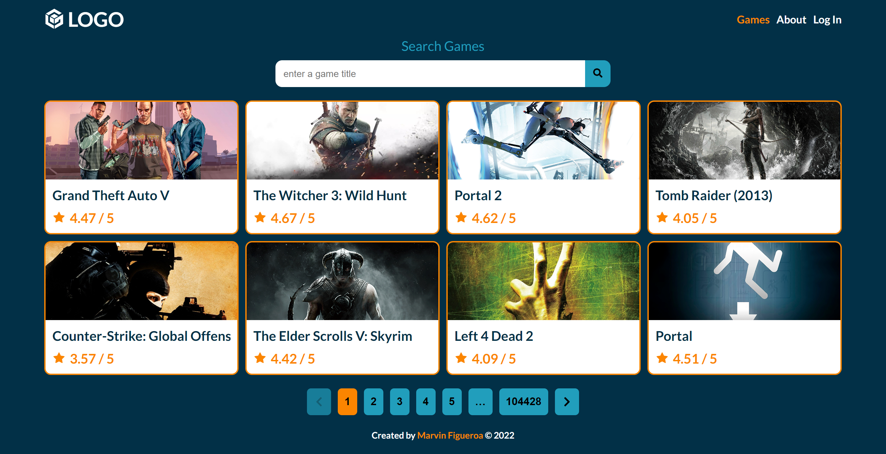
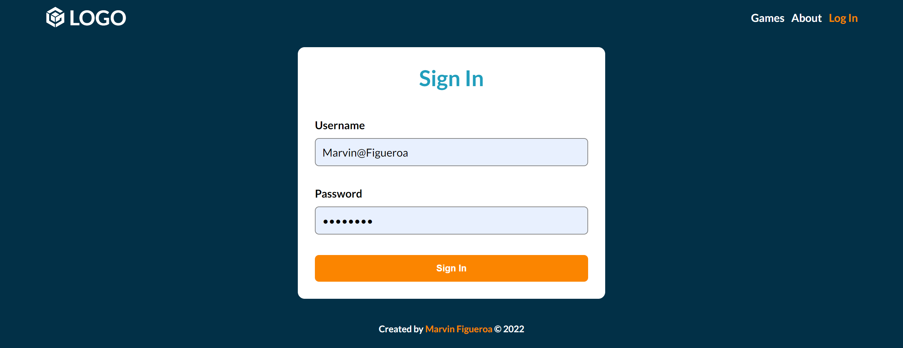
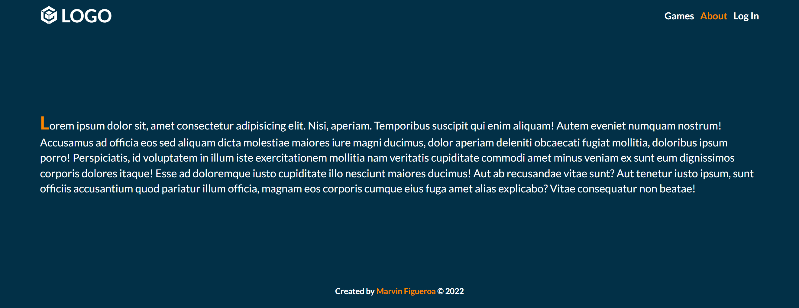
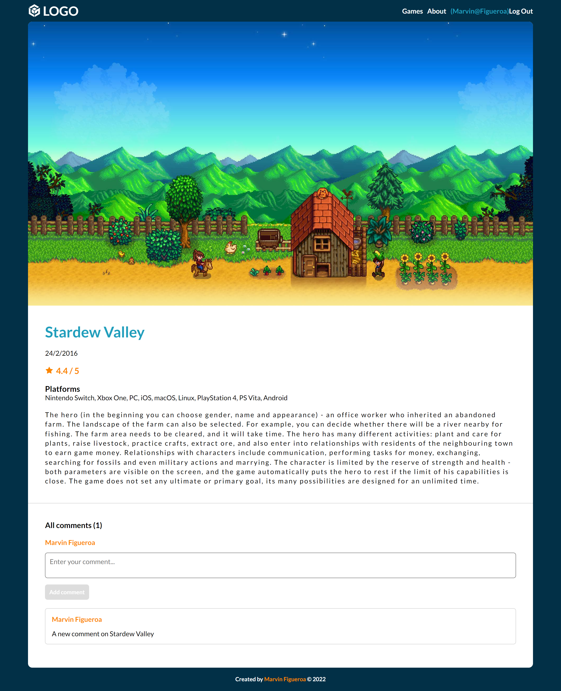

# Homework Week 6

## Description

Based on the last homework, install, configure and use TypeScript in the whole project, transform all the js and jsx files into ts and tsx files. Create types or interfaces for the data you get from the API. Refactor your code so you use React Router instead of conditional rendering.

## Live Site

[Vercel Deployment](https://homework-week-6.vercel.app/)

## Built With

- Semantic HTML5 markup
- CSS Flexbox
- CSS Grid
- Media Querys
- Desktop-First approach
- Sass / Scss
- JavaScript
- RAWG Games API
- Fetch API (GET, POST)
- json-server deployed to glitch as a backend
- React JS Basics
- React Router Basics
- React Hooks
- react-icons package
- react-spinners package

## Visuals

**Screenshots Desktop #1**

**Screenshots Desktop #2**

**Screenshots Desktop #3**

**Screenshots Desktop #4**

